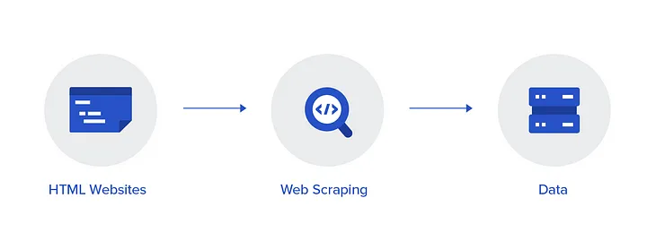

# Biblioteca JSOUP

## Introdução

>📝 **Jsoup** 
 é uma das bibliotecas que simplica o trabalho com HTML e XML em Java. oferece uma API fácil de usar para busca de URL, análise de dados, extração e manipulação usando métodos DOM , CSS e seletores xpath. 

## Desenvolvimento

### Principais Propriedades da Bibliotecas

|**Critério** | **Descrição**   |
| ------ | ----------------------------------- | 
| Tipo de Conteúdo (Estático ou Dinâmico)  | O Jsoup é ideal para trabalhar com conteúdo estático, ou seja, páginas HTML que não dependem da execução de scripts ou carregamento dinâmico de dados via JavaScript                      |
| Desempenho  |  O Jsoup é rápido em tarefas simples, como buscar, extrair e manipular dados de páginas estáticas                         |
|Suporte a JavaScript|  Ele funciona excepcionalmente bem para blogs, fóruns ou sites estáticos onde o JavaScript não é um fator importante na renderização de conteúdo.|
|Suporte ao usuário| O Jsoup não permitindo que você interaja com as páginas como se um usuário estivesse navegando no site|
|Integração com Outras Tecnologias|O Jsoup é uma biblioteca de Java, então ele se integra facilmente com outras tecnologias do ecossistema Java, como Spring, Retrofit, ou ferramentas de I/O como java.nio.file para manipulação de arquivos.|

### Diagrama de Extração de Dados  

O processo de raspagem de dados começa com a identificação da página da web onde se deseja
extrair os dados. Na etapa de extração de dados utilizamos uma ferramentas de raspagens de dados como a biblioteca Jsoup para navegar pela página extrair os dados desejados e armazená-los de forma estruturada. Mas antes de armazena-los é necessário limpar os dados, etapa na qual se remove qualquer tipo de dados não desejado como tag html, ou células vazias. A última etapa é o armazenamento de dados limpo em um formato estruturado que pode ser facilmente analisados e acessado por outros aplicativos ou ferramentas. 

[Fonte: Raspagem de Dados com Java - Utilizando Jsoup](https://youtu.be/ALTnW09yeAw?si=f1TmBM43YmWRDg-k)

## Conclusão
Jsoup é uma ferramenta excelente para scraping de conteúdo estático. Sua simplicidade e facilidade de uso a tornam uma das melhores opções para manipulação de HTML puro e acesso a dados de páginas da web.
No entanto, para conteúdo dinâmico ou páginas interativas que requerem execução de JavaScript, ferramentas adicionais como Selenium seriam necessárias.

## Referências 

- [Retrofit](https://square.github.io/retrofit/)
- [Jsoup Tutorial](https://www.javatpoint.com/jsoup-tutorial)

- [Spring Initializr](https://start.spring.io/)

- [Maven Repository](https://mvnrepository.com/artifact/org.jsoup/jsoup)

- [Package java.nio.file](https://docs.oracle.com/en/java/javase/11/docs/api/java.base/java/nio/file/package-summary.html)

- [Documentação JSOUP](https://jsoup.org/)

- [Web Scraping with Java (Jsoup)](https://medium.com/@yashpatel007/getting-started-with-web-scraping-9ee7ddf2dd71)

- [Raspagem de Dados com Java - Utilizando Jsoup](https://youtu.be/ALTnW09yeAw?si=r8EC9_uZgtC6thvF)

- [https://stackoverflow.com/questions/33982064/selenium-vs-jsoup-performance](https://stackoverflow.com/questions/33982064/selenium-vs-jsoup-performance)

- [10 Best Java Web Scraping Libraries
](https://medium.com/@datajournal/best-java-web-scraping-libraries-5deb6e98a04f#:~:text=Unlike%20libraries%20like%20Jsoup%2C%20Selenium,pages%20that%20require%20user%20interaction.)

